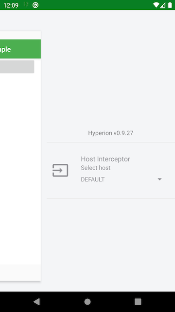

# Hyperion Host Interceptor

A [Hyperion](https://github.com/willowtreeapps/Hyperion-Android) plugin that allows you to change the host of [OkHttp](https://square.github.io/okhttp) client from the debug menu.



## Integration

This library requires Java 8 bytecode. To enable Java 8 desugaring configure it in your Gradle script.

```groovy
android {
  compileOptions {
    sourceCompatibility JavaVersion.VERSION_1_8
    targetCompatibility JavaVersion.VERSION_1_8
  }
  // For Kotlin projects
  kotlinOptions {
    jvmTarget = "1.8"
  }
}
```

To integrate it with your app you need to add a dependency on this plugin to your project and add `HostInterceptor` to your `OkHttp` client.

```groovy
debugImplementation "io.mehow.hyperion:hyperion-host-interceptor:0.2.0"
debugImplementation "com.willowtreeapps.hyperion:hyperion-core:$HyperionCurrentVersion"
```

```kotlin
Environment.init(
    context,
    Environment("QA", "https://www.qa.com".toHttpUrl()),
    Environment("STAGING", "https://www.staging.com".toHttpUrl()),
    Environment("RELEASE", "https://www.release.com".toHttpUrl())
)
val interceptor = HostInterceptor(context)
val client = OkHttpClient.Builder()
    .addInterceptor(interceptor)
    .build()
```

Environments should be initialized before Hyperion initializes its plugins. The best place for it is the `Application` object. Check [the sample](sample/) for more information.

## License

    Copyright 2019 Michał Sikora

    Licensed under the Apache License, Version 2.0 (the "License");
    you may not use this file except in compliance with the License.
    You may obtain a copy of the License at

       http://www.apache.org/licenses/LICENSE-2.0

    Unless required by applicable law or agreed to in writing, software
    distributed under the License is distributed on an "AS IS" BASIS,
    WITHOUT WARRANTIES OR CONDITIONS OF ANY KIND, either express or implied.
    See the License for the specific language governing permissions and
    limitations under the License.
